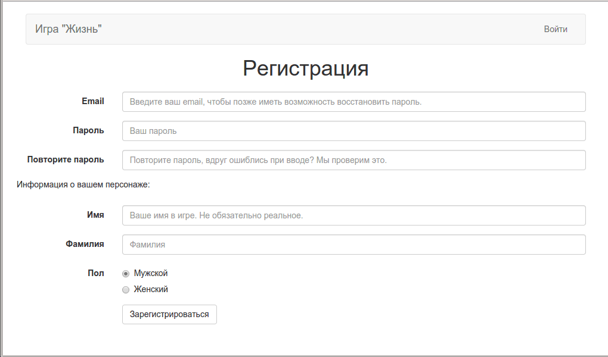

PrettyForms.js
===========

Библиотека, облегчающая работу с формами.

Валидирует форму, отправляет данные на сервер
и выполняет команды с сервера, полученные в ответ.

Зависимости: jQuery.

Суть идеи в том, что писать каждый раз уникальный JS
код для какой-то простой формы - это слишком долго и нудно.
Зачастую, нам надо просто послать данные на сервер,
а после этого выполнить пару простых действий. Данная библиотека решает эту проблему.

Самая маленькая форма - это одна простая кнопка:

```html
<div class='senddata' data-link='/messages/del/1'>Удалить сообщение</div>
```

Клик на неё отправит запрос на сервер, а сервер должен вернуть в ответ команды,
которые выполнятся на стороне браузера. Например, что-то вроде этого:

Серверная сторона, PHP фреймворк Laravel:
```php
Route::get('/messages/del/{id}', function () {
    // валидируем запрос, удаляем сообщение
    return [
        // название команды
        'success' => [
            // данные, которые будут переданы команде
            'title' => 'Сообщение удалено',
            'text' => 'Ваше сообщение было успешно удалено',
        ]
        // и таких команд может быть сколько угодно!
    ];
});

```

Сервер удалит сообщение, а библиотека покажет в браузере сообщение об
успешном удалении. Вот и весь механизм :)


